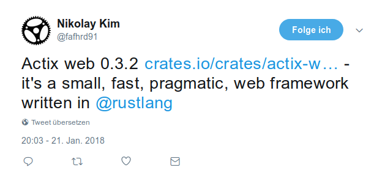
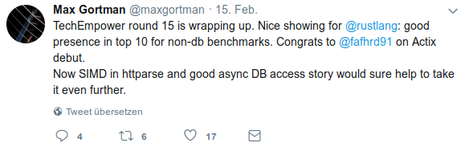
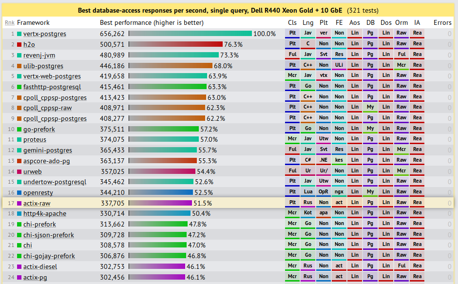
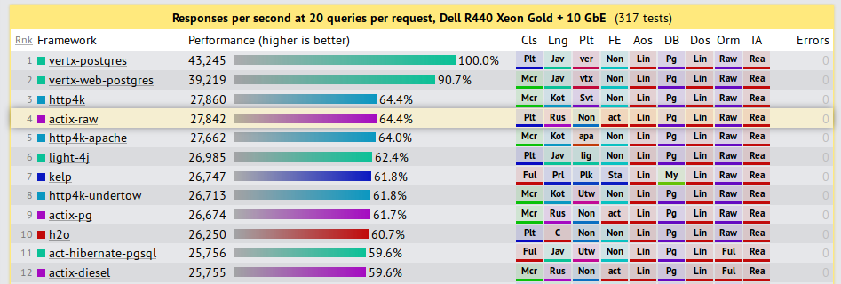
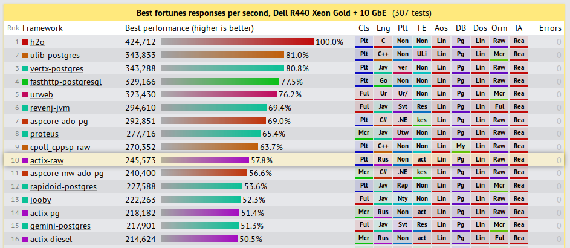
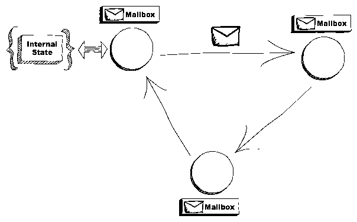

% Actix
% Pirmin Kalberer @implgeo
% Rust Zurich, 11. Juli 2018

# About me

## Sourcepole

* Geospatial software
  (C++, Python, React, Ruby on Rails, ...)
* Creating maps with Rust!

## Language history

. . .

Basic

. . .

Assembler (6502)

. . .

(Turbo) Pascal

. . .

Modula

. . .

C

. . .

C++

. . .

Java

---

Eiffel

. . .

Perl

. . .

Ruby

. . .

Javascript

. . .

Python

. . .

Rust (2016)


# Rust Web Frameworks

## Hyper

* Low-Level
* Synchronous -> Asynchronous
* Base of iron, gotham, rocket, nickel, ...

## Rocket

* Nice API & concepts
* Beautiful documentation
* Requires Nightly
* Synchronous

## actix-web



---



. . .


# Benchmark

## TechEmpower Web Framework Benchmark

Performance high-water marks for trivial exercises of framework functionality (routing, ORM, templates, etc.).

Real world apps will be substantially more complex with far lower RPS.

## JSON serialization

JSON serialization of a freshly-instantiated object.

```
{"message":"Hello, World!"}
```

---


## Single query

Fetching a single row from a simple database table and serializing as a JSON response.

```
{"id":3217,"randomNumber":2149}
```

---




## Multiple queries

Fetching multiple rows from a simple database table and serializing these rows as a JSON response.

The test is run multiple times: testing 1, 5, 10, 15, and 20 queries per request. All tests are run at 256 concurrency.

---



## Fortunes

The framework's ORM is used to fetch all rows from a database table containing an unknown number of Unix fortune cookie messages. An additional fortune cookie message is inserted into the list at runtime and then the list is sorted by the message text. Finally, the list is delivered to the client using a server-side HTML template.

---



## Data updates

Fetching multiple rows from a simple database table, converting the rows to in-memory objects, modifying one attribute of each object in memory, updating each associated row in the database individually, and then serializing the list of objects as a JSON response.

---


## Plaintext

"Hello, World" message rendered as plain text.
```
Hello, World!
```

---


# Synchronous vs. Asynchronous

## Synchronous

. . .

Single Threaded:


. . .

Multi-Threaded:


https://codewala.net/2015/07/29/concurrency-vs-multi-threading-vs-asynchronous-programming-explained/


## Asynchronous

. . .

Single Threaded:


. . .

Multi-Threaded:


# Actix actors framework

## Actor model

An actor is a computational entity that contains state information and can send, receive and handle messages.



https://www.brianstorti.com/the-actor-model/

## Actix features

* Async/Sync actors
* Actor communication in a local/thread context
* Uses Futures for asynchronous message handling
* Actor supervision
* Typed messages

## Actor

```Rust
struct MyActor {
    count: usize,
}

impl Actor for MyActor {
    type Context = Context<Self>;
}
```

## Message

```Rust
struct Ping(usize);

impl Message for Ping {
    type Result = usize;
}
```

## Handler

```Rust
impl Handler<Ping> for MyActor {
    type Result = usize;

    fn handle(&mut self, msg: Ping, ctx: &mut Context<Self>) -> Self::Result {
        self.count += msg.0;

        self.count
    }
}
```

## System

```Rust
fn main() {
    let system = System::new("test");

    // start new actor
    let addr: Addr<Unsync, _> = MyActor{count: 10}.start();

    // send message and get future for result
    let res = addr.send(Ping(10));

    Arbiter::handle().spawn(
        res.map(|res| {
            println!("RESULT: {}", res == 20);
        })
        .map_err(|_| ()));

    system.run();
}

```


# Actix web

## Features

* Support for HTTP/1.x and HTTP/2.0 protocols
* Streaming and pipelining
* Keep-alive and slow requests handling
* Client/server WebSockets support
* Transparent content compression/decompression (br, gzip, deflate)
* Configurable request routing

---

* Graceful server shutdown
* Multipart streams
* Static assets
* SSL support with OpenSSL or native-tls
* Middleware (Logger, Session, Redis sessions, DefaultHeaders, CORS, CSRF)
* Includes an asynchronous HTTP client
* Built on top of Actix actor framework

https://actix.rs

## Hello World

```Rust
extern crate actix_web;
use actix_web::{server, App, HttpRequest};

fn index(_req: HttpRequest) -> &'static str {
    "Hello world!"
}

fn main() {
    server::new(|| App::new().resource("/", |r| r.f(index)))
        .bind("127.0.0.1:8088")
        .unwrap()
        .run();
}
```

## Application State

```Rust
struct AppState {
    counter: Cell<usize>,
}

fn index(req: HttpRequest<AppState>) -> String {
    let count = req.state().counter.get() + 1; // <- get count
    req.state().counter.set(count); // <- store new count in state

    format!("Request number: {}", count) // <- response with count
}

// State initialization:
App::with_state(AppState { counter: Cell::new(0) })
    .resource("/", |r| r.method(http::Method::GET).f(index))
    .finish()
```

---

Application state is shared with all routes and resources within the same application (`App`).

Note: Http server constructs an application instance for each thread, thus application state must be constructed multiple times.

## Request handler

```Rust
fn index(_req: HttpRequest) -> &'static str {
    "Hello world!"
}
```

`Handler` trait: A request handler accepts an `HttpRequest` instance as parameter 
and returns a type that can be converted into `HttpResponse` (`Responder` trait).


## Async handlers

```Rust
fn async(req: HttpRequest) -> Box<Future<Item=&'static str, Error=Error>> {
    result(Ok("Welcome!"))
        .responder()
}

fn main() {
    App::new()
        .resource("/async", |r| r.route().a(async)) // <- use `a`
        .finish();
}
```

## Path info extraction

```Rust
/// extract path info from "/{username}/{count}/index.html" url
/// {username} - deserializes to a String
/// {count} -  - deserializes to a u32
fn index(info: Path<(String, u32)>) -> Result<String> {
    Ok(format!("Welcome {}! {}", info.0, info.1))
}

fn main() {
    let app = App::new().resource(
        "/{username}/{count}/index.html", // <- define path parameters
        |r| r.method(http::Method::GET).with(index) // <- use `with` extractor
        .finish();
    );
}
```

---

Option 2: Access by calling extract() on the extractor

```Rust
use actix_web::FromRequest;

fn index(req: HttpRequest) -> HttpResponse {
    let params = Path::<(String, String)>::extract(&req);
    let info = Json::<MyInfo>::extract(&req); 

    ...
}
```

## Path info extraction with structs

```Rust
#[derive(Deserialize)]
struct Info {
    username: String,
}

/// extract path info using serde
fn index(info: Path<Info>) -> Result<String> {
    Ok(format!("Welcome {}!", info.username))
}

```

## Query parameter extraction

```Rust
#[derive(Deserialize)]
struct Info {
    username: String,
}

// this handler get called only if request's query contains `username` field
fn index(info: Query<Info>) -> String {
    format!("Welcome {}!", info.username)
}

fn main() {
    let app = App::new().resource(
       "/index.html",
       |r| r.method(http::Method::GET).with(index)); // <- use `with` extractor
}
```

## JSON in requests

```Rust
#[derive(Deserialize)]
struct Info {
    username: String,
}

/// deserialize `Info` from request's body
fn index(info: Json<Info>) -> Result<String> {
    Ok(format!("Welcome {}!", info.username))
}

fn main() {
    let app = App::new().resource(
       "/index.html",
       |r| r.method(http::Method::POST).with(index));  // <- use `with` extractor
}
```

## JSON in responses

```Rust
#[derive(Serialize)]
struct MyObj {
    name: String,
}

fn index(req: HttpRequest) -> Result<Json<MyObj>> {
    Ok(Json(MyObj {
        name: req.match_info().query("name")?,
    }))
}
```

## Form handling

```Rust
#[derive(Deserialize)]
struct FormData {
    username: String,
}

/// extract form data using serde
/// this handler gets called only if the content type is *x-www-form-urlencoded*
/// and the content of the request could be deserialized to a `FormData` struct
fn index(form: Form<FormData>) -> Result<String> {
     Ok(format!("Welcome {}!", form.username))
}
```

## Multiple extractors

```Rust
fn index((path, query): (Path<(u32, String)>, Query<Info>)) -> String {
    format!("Welcome {}!", query.username)
}

fn main() {
    let app = App::new().resource(
       "/users/{userid}/{friend}",                    // <- define path parameters
       |r| r.method(http::Method::GET).with(index)); // <- use `with` extractor
}
```

Actix provides extractor implementations for tuples (up to 10 elements) whose elements implement FromRequest.

## Request routing

```Rust
fn index(req: HttpRequest) -> impl Responder {
    "Hello from the index page"
}

fn hello(path: Path<String>) -> impl Responder {
    format!("Hello {}!", *path)
}

fn main() {
    App::new()
        .resource("/", |r| r.method(Method::Get).with(index))
        .resource("/hello/{name}", |r| r.method(Method::Get).with(hello))
        .finish();
}
```


## Middleware - CORS

```Rust
let app = App::new().configure(|app| {
    Cors::for_app(app) // <- Construct CORS middleware builder
        .allowed_origin("https://www.rust-lang.org/")
        .allowed_methods(vec!["GET", "POST"])
        .allowed_headers(vec![http::header::AUTHORIZATION, http::header::ACCEPT])
        .allowed_header(http::header::CONTENT_TYPE)
        .max_age(3600)
        .resource(/* ... */)
        .register()
});
```

## Middleware - CORS (allow from all)

```Rust
let app = App::new().configure(|app| {
    Cors::for_app(app) // <- Construct CORS middleware builder
        .send_wildcard()
        .allowed_methods(vec![Method::GET])
        .resource(/* ... */)
        .register()
});
```

## Middleware - CSRF

```Rust
let app = App::new()
    .middleware(
        csrf::CsrfFilter::new().allowed_origin("https://www.example.com"),
    )
    .resource("/", |r| {

```

Origin Header based.

## Middleware - User Sessions

```Rust
fn index(req: HttpRequest) -> Result<&'static str> {
    // access session data
    if let Some(count) = req.session().get::<i32>("counter")? {
        println!("SESSION value: {}", count);
        req.session().set("counter", count+1)?;
    } else {
        req.session().set("counter", 1)?;
    }

    Ok("Welcome!")
}
```
---

```Rust
fn main() {
    actix::System::run(|| {
        server::new(
          || App::new().middleware(
              SessionStorage::new(          // <- create session middleware
                CookieSessionBackend::signed(&[0; 32]) // <- create signed cookie session backend
                    .secure(false)
             )))
            .bind("127.0.0.1:59880").unwrap()
            .start();
    });
}

```

* Built-in: Session Cookie
* Other implementations must implement `SessionBackend`

## Middleware - Identity handling

```Rust
fn index(req: HttpRequest) -> Result<String> {
    // access request identity
    if let Some(id) = req.identity() {
        Ok(format!("Welcome! {}", id))
    } else {
        Ok("Welcome Anonymous!".to_owned())
    }
}

fn login(mut req: HttpRequest) -> HttpResponse {
    req.remember("User1".to_owned()); // <- remember identity
    HttpResponse::Ok().finish()
}

fn logout(mut req: HttpRequest) -> HttpResponse {
    req.forget(); // <- remove identity
    HttpResponse::Ok().finish()
}
```
---

```Rust
fn main() {
    let app = App::new().middleware(IdentityService::new(
        // <- create identity middleware
        CookieIdentityPolicy::new(&[0; 32])    // <- create cookie session backend
              .name("auth-cookie")
              .secure(false),
    ));
}
```

* Built-in: Cookie based identity
* Other implementations must implement `RequestIdentity`

## Static file handler

```Rust
use actix_web::{fs, App};

fn main() {
    let app = App::new()
        .handler("/static", fs::StaticFiles::new("."))
        .finish();
}
```

## Testing support

```Rust
fn index(req: HttpRequest) -> HttpResponse {
    if let Some(hdr) = req.headers().get(header::CONTENT_TYPE) {
        HttpResponse::Ok().into()
    } else {
        HttpResponse::BadRequest().into()
    }
}

fn main() {
    let resp = TestRequest::with_header("content-type", "text/plain")
        .run(index)
        .unwrap();
    assert_eq!(resp.status(), StatusCode::OK);

    let resp = TestRequest::default().run(index).unwrap();
    assert_eq!(resp.status(), StatusCode::BAD_REQUEST);
}
```


## HTTP Client API

```Rust
use actix_web::client;

fn main() {
    tokio::run({
        client::get("http://www.rust-lang.org")   // <- Create request builder
            .header("User-Agent", "Actix-web")
            .finish().unwrap()
            .send()                               // <- Send http request
            .map_err(|_| ())
            .and_then(|response| {                // <- server http response
                println!("Response: {:?}", response);
                Ok(())
            })
    });
}
```

# Real World Applications

## Fundstelleninventar

* JsonAPI served with Actix
* DB access with Diesel
* React client app

## Time tracking UI

* JsonAPI served with Actix
* DB access with Diesel
* React client app

## t-rex

* Vector Tile Server
* Command line and web server
* Actix-Web + Actix (planned)
* Integrated web app
* PostGIS + GDAL data sources

https://t-rex.tileserver.ch/
